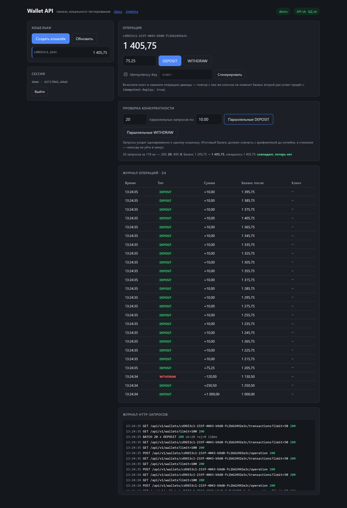

# Wallet API

[](https://github.com/Kakadu525/wallet-api/actions/workflows/ci.yml)

Асинхронный REST API для операций с балансом кошельков на FastAPI + PostgreSQL.

Поверх операций с балансом: журнал операций, идемпотентность запросов, аутентификация с проверкой владельца, rate limiting и метрики Prometheus.



> Встроенная панель на `/ui`: операции с балансом, проверка конкурентности (20 параллельных запросов сходятся до копейки) и append-only журнал операций.

## Стек

- **FastAPI** — асинхронный веб-фреймворк
- **SQLAlchemy 2.0 (async) + asyncpg** — работа с БД
- **PostgreSQL 16** — хранилище
- **Alembic** — миграции схемы БД
- **prometheus-client** — метрики
- **Docker / docker-compose** — инфраструктура
- **pytest + httpx** — тесты против настоящего PostgreSQL

## Быстрый старт

```bash
docker compose up --build
```

- API: `http://localhost:8000`
- Панель тестирования (UI): `http://localhost:8000/ui`
- Swagger / OpenAPI: `http://localhost:8000/docs`
- Метрики: `http://localhost:8000/metrics`

Миграции применяются автоматически при старте контейнера `api`.

### Веб-интерфейс

На `/ui` — панель для ручной проверки без curl: регистрация пользователя (токен сохраняется в браузере), создание кошельков, операции DEPOSIT/WITHDRAW, журнал операций, демонстрация идемпотентности (та же операция с одним ключом не применяется дважды) и кнопка нагрузочной проверки конкурентности (N параллельных запросов к одному кошельку с проверкой, что баланс сошёлся до копейки).

## Аутентификация

Все операции с кошельками требуют токен. Токен выдаётся при регистрации **один раз** — в БД хранится только его SHA-256-хеш.

```bash
# 1. Регистрация — получаем токен
curl -X POST http://localhost:8000/api/v1/auth/register \
  -H 'Content-Type: application/json' -d '{"username":"alice"}'
# -> {"user_id":"...","username":"alice","token":"whk_..."}

# 2. Дальше во всех запросах передаём его в заголовке
curl -X POST http://localhost:8000/api/v1/wallets \
  -H 'Authorization: Bearer whk_...'
```

Кошелёк принадлежит создателю. Чужой кошелёк отдаётся как `404` (а не `403`), чтобы по коду ответа нельзя было проверять существование чужих идентификаторов.

## Эндпоинты

| Метод | Путь | Описание |
|---|---|---|
| `POST` | `/api/v1/auth/register` | Регистрация, выдача API-токена |
| `GET` | `/api/v1/auth/me` | Текущий пользователь (проверка токена) |
| `POST` | `/api/v1/wallets` | Создать кошелёк |
| `GET` | `/api/v1/wallets` | Список своих кошельков |
| `POST` | `/api/v1/wallets/{id}/operation` | Изменить баланс (`DEPOSIT` / `WITHDRAW`) |
| `GET` | `/api/v1/wallets/{id}` | Текущий баланс |
| `GET` | `/api/v1/wallets/{id}/transactions` | Журнал операций кошелька |
| `GET` | `/health` | Живость + доступность БД |
| `GET` | `/metrics` | Метрики Prometheus |

### Операция с балансом

```
POST /api/v1/wallets/{id}/operation
Authorization: Bearer whk_...
Idempotency-Key: 3fa85f64-...      # необязательный
Content-Type: application/json

{ "operation_type": "DEPOSIT", "amount": "1000.00" }
```

Ответ содержит итоговый баланс и запись журнала:

```json
{
  "wallet_id": "3fa85f64-...",
  "balance": "1000.00",
  "transaction_id": "9c1e...",
  "type": "DEPOSIT",
  "amount": "1000.00",
  "replayed": false
}
```

## Как это устроено

### Конкурентность (ключевое требование)

Изменение баланса — один атомарный SQL-запрос:

```sql
UPDATE wallets
   SET balance = balance - :amount
 WHERE id = :id AND owner_id = :uid AND balance >= :amount
RETURNING balance
```

Новое значение вычисляет **сама БД** по актуальной версии строки, а не приложение по устаревшей копии, поэтому классический *lost update* невозможен. `UPDATE` берёт блокировку строки: параллельный запрос к тому же кошельку ждёт на ней, после чего PostgreSQL перечитывает строку и заново проверяет `balance >= :amount` — списание не уходит в минус, потому что проверка и списание неделимы. Операции над разными кошельками не мешают друг другу (блокируется строка, а не таблица). Дополнительно на уровне схемы стоит `CHECK (balance >= 0)`.

Подтверждено тестами `test_concurrent_*` — 20+ параллельных запросов к одному кошельку с проверкой, что итог математически точен.

### Журнал операций

Append-only таблица `transactions`: одна строка на каждое изменение баланса, только вставки. Запись в журнал делается в **той же транзакции БД**, что и `UPDATE` баланса, — баланс и его история не могут разъехаться. Поле `balance_after` фиксирует баланс сразу после операции.

### Идемпотентность

Заголовок `Idempotency-Key` даёт гарантию «ровно один раз» через `UNIQUE(wallet_id, idempotency_key)`:

- повтор с известным ключом возвращает результат исходной операции, не трогая баланс (`replayed: true`, заголовок `Idempotent-Replay: true`);
- при гонке двух одинаковых запросов второй `INSERT` упирается в ограничение, и его транзакция откатывается **целиком, включая изменение баланса** — дельта применяется один раз;
- тот же ключ с другой суммой/типом — это коллизия, а не повтор: возвращается `409`.

### Rate limiting

Скользящее окно на клиента (по токену, иначе по IP), настраивается через `RATE_LIMIT_*`. Превышение — `429` с заголовком `Retry-After`. Состояние in-process: для нескольких воркеров/реплик лимит станет общим только через внешнее хранилище (Redis) — это осознанное ограничение демо, задокументированное в `app/rate_limit.py`.

### Метрики

`/metrics` в формате Prometheus: счётчики HTTP-запросов и операций с балансом, гистограмма длительности. Метки путей — по шаблону маршрута (`/api/v1/wallets/{wallet_id}`), а не по сырому пути с UUID, чтобы не взрывать кардинальность.

## Тесты

Гоняются против настоящего PostgreSQL (не SQLite, не моки) — это принципиально для проверки блокировок строк.

```bash
docker compose up -d db
docker compose -f docker-compose.yml -f docker-compose.test.yml run --rm api-test
```

## Структура проекта

```
app/
├── main.py            — точка входа, middleware, /health, /metrics, монтирование UI
├── config.py          — настройки (pydantic-settings)
├── database.py        — асинхронный движок и сессии SQLAlchemy
├── models.py          — модели User, Wallet, Transaction
├── schemas.py         — Pydantic-схемы запросов/ответов
├── crud.py            — доменная логика: операции, журнал, идемпотентность
├── security.py        — токены и зависимость аутентификации
├── rate_limit.py      — ограничитель частоты запросов
├── metrics.py         — метрики Prometheus
├── api/
│   ├── auth.py        — регистрация и /me
│   └── wallets.py     — эндпоинты кошельков
└── static/index.html  — веб-панель тестирования

alembic/               — миграции БД (0001–0003)
tests/                 — pytest против реального PostgreSQL
```

## Локальный запуск без Docker

```bash
python -m venv venv
source venv/bin/activate            # Windows: venv\Scripts\activate
pip install -r requirements-dev.txt

cp .env.example .env                 # при необходимости поправьте DATABASE_URL

alembic upgrade head
uvicorn app.main:app --reload
```
